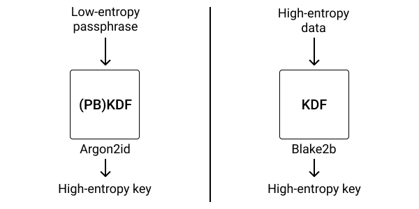

# Low Entropy File Encrypter

This is a simple yet effective method to encrypt your private key utilizing Argon2.
Argon2 was selected as the winner of the 2015 Password Hashing Competition (which apparently should mean a lot).
Well, there are indeed some fair reasons for that.


## Argon2

Argon2 is key derivation function which hasn't been hacked yet (on 12/6/2022 or no at least not publicly).
It allows to create ["a secure key from a not-so-secure source"](https://kerkour.com/rust-file-encryption-chacha20poly1305-argon2).



Pic. 1 - A comparison between low-entropy and high-entropy sources ([Kerkour, 2022.](https://kerkour.com/rust-file-encryption-chacha20poly1305-argon2))

In the picture, you can notice the suffix "id" in Argon2id. Also, there are two other versions of Argon2.
Feel free to read more information on [Wikipedia](https://en.wikipedia.org/wiki/Argon2).

## Run


```bash
cargo run private_key.json
```

## Contributing

Pull requests are welcome. For major changes, please open an issue first
to discuss what you would like to change.

Please make sure to update tests as appropriate.

## License

[MIT](https://choosealicense.com/licenses/mit/)